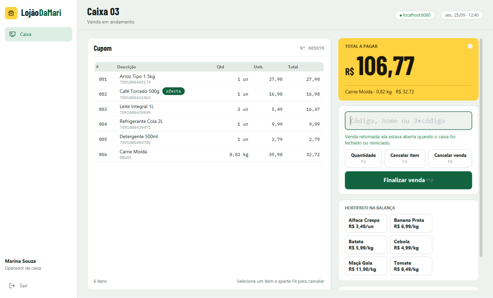
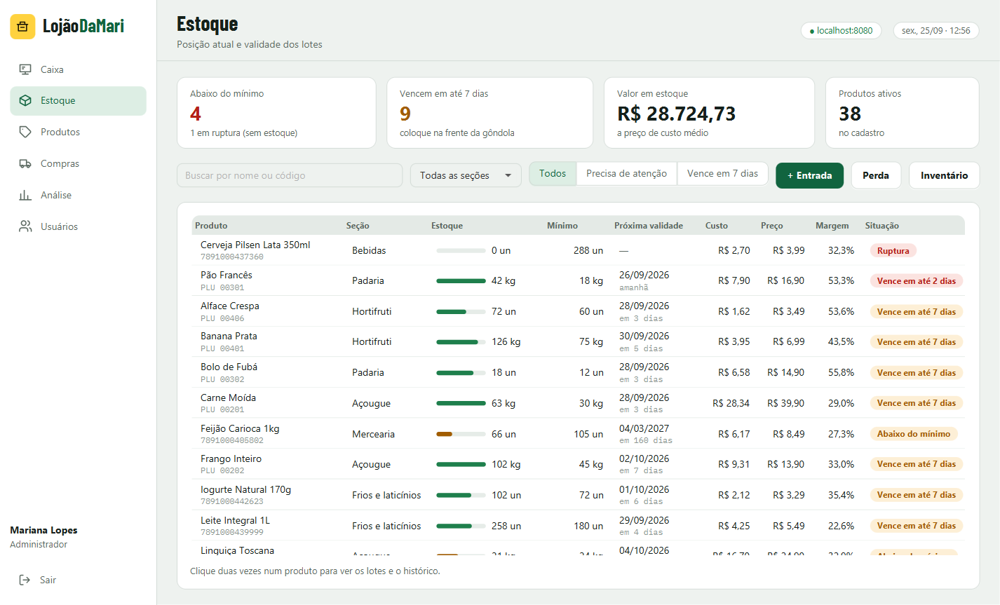
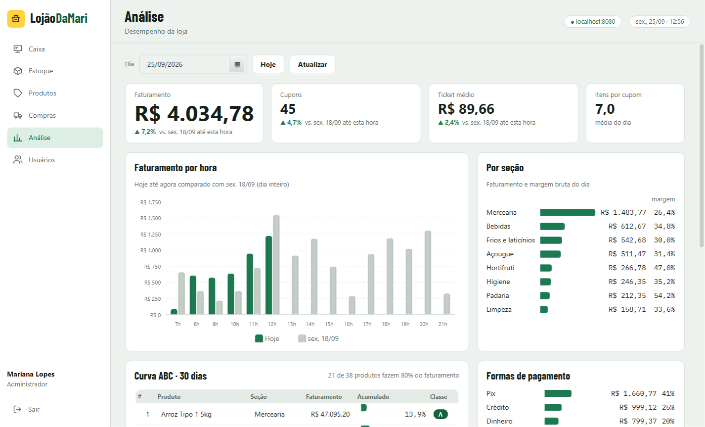
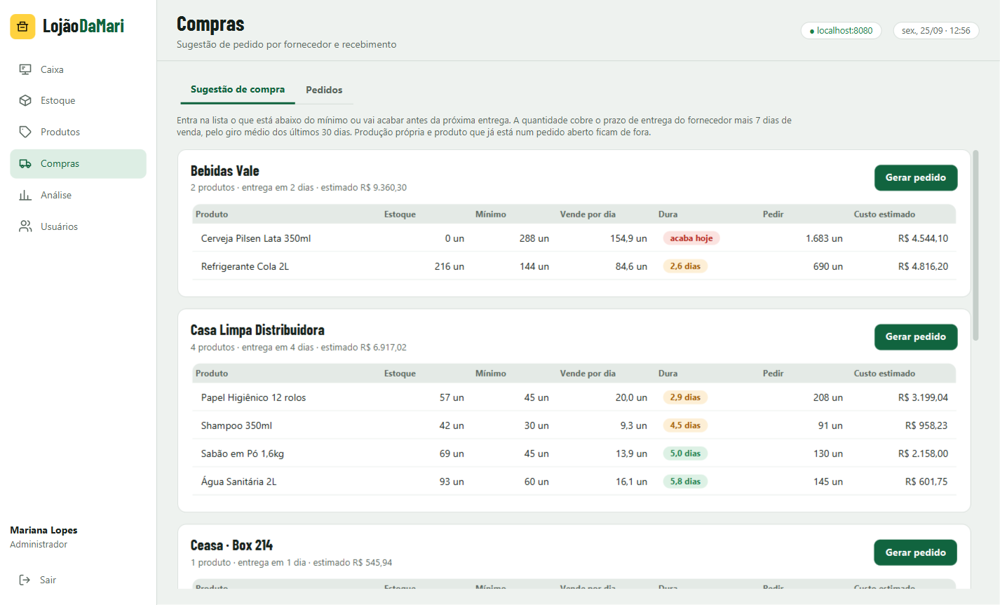
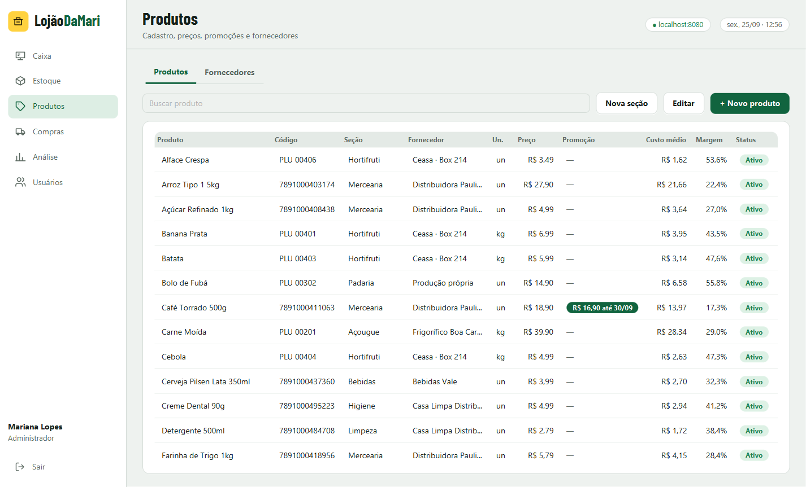

# LojãoDaMari

Sistema de supermercado em Java: um **app desktop** para o caixa e a retaguarda, com o **servidor da loja
embutido**. O usuário abre um programa só. Numa loja com vários caixas, os outros computadores se
conectam no servidor do computador principal.

- **Caixa (PDV):** leitor de código de barras, etiqueta de balança, hortifruti pesado no caixa,
  cancelamento com senha do fiscal, pagamento dividido com troco, CPF na nota, cupom impresso,
  sangria, suprimento e fechamento de caixa.
- **Estoque:** lotes com validade (sai primeiro o que vence primeiro), entrada, perda, inventário e
  histórico de cada produto.
- **Compras:** sugestão de pedido pelo giro de vendas e pelo prazo do fornecedor, pedido e recebimento
  lote por lote.
- **Análise:** faturamento do dia comparado com a semana passada, vendas por hora, margem por seção,
  formas de pagamento, curva ABC e conferência dos fechamentos de caixa.



| Estoque | Análise |
|---|---|
|  |  |
| **Compras** | **Produtos** |
|  |  |

## Executável (Windows)

```bat
gerar-executaveis.cmd
```

Isso gera `dist\LojaoDaMari\LojaoDaMari.exe` e o mesmo programa compactado em `dist\LojaoDaMari.zip`.
É **um programa só**, com o Java e o servidor da loja dentro: roda em computador sem Java e sem MySQL.
Pra levar pra outro computador, copie o `.zip`, descompacte e abra o `LojaoDaMari.exe`.

Ao abrir, o app liga o servidor por dentro (leva uns 20 segundos, e na primeira vez cria a loja de
exemplo) e desliga junto quando a janela fecha. Os dados ficam em `C:\Users\<usuário>\.lojaodamari`,
fora da pasta do programa, então trocar a versão do app não apaga nada.

| Arquivo em `.lojaodamari` | O que é |
|---|---|
| `dados\lojaodamari.mv.db` | O banco da loja (H2) |
| `lojaodamari.log` | Registro do servidor, pra investigar erro |
| `desktop.properties` | Número do caixa e o último login deste computador |
| `servidor.properties` | Opcional: pra usar MySQL, coloque aqui `spring.datasource.url`, `username` e `password` |

**Vários caixas na mesma loja:** o computador principal abre o app normalmente. O servidor dele atende
a rede na porta 8080 (libere no firewall do Windows quando ele perguntar). Nos outros computadores,
coloque em `.lojaodamari\desktop.properties` a linha `servidor=http://IP-DO-PRINCIPAL:8080`: assim o
app só se conecta ao principal, sem ligar um servidor próprio.

Pra gerar um instalador `.msi` em vez da pasta, instale o [WiX Toolset](https://wixtoolset.org) e troque
`--type app-image` por `--type msi` no script.

## Como rodar pelo código

Precisa do **Java 25**. O Maven não precisa ser instalado: o projeto já vem com o `mvnw`.

```bat
iniciar-app.cmd
```

Abre o app, que liga o servidor por dentro, igual ao executável. Pra rodar **só o servidor** (numa
máquina separada, ou pra testar a API pelo Swagger):

```bat
iniciar-servidor.cmd h2     :: sem MySQL, banco num arquivo na pasta dados
iniciar-servidor.cmd        :: com MySQL
```

**Com MySQL** (o mesmo do MySQL Workbench): crie o arquivo `config/application.properties` na
raiz do projeto com a sua senha. Essa pasta não vai pro Git.

```properties
spring.datasource.password=sua_senha_do_mysql
```

O banco `lojaodamari` e as tabelas são criados sozinhos na primeira vez.

**Sem os atalhos** (qualquer sistema):

```bash
./mvnw install -DskipTests
./mvnw -pl desktop javafx:run                                                   # app com o servidor dentro
java -jar servidor/target/servidor-1.0.0-exec.jar --spring.profiles.active=h2   # só o servidor
```

> Se o Maven der erro de certificado (`PKIX path building failed`), o antivírus está inspecionando o
> HTTPS. No Windows, rode antes: `set MAVEN_OPTS=-Djavax.net.ssl.trustStoreType=Windows-ROOT`
> (os atalhos `.cmd` já fazem isso).

## Usuários de demonstração

Na primeira vez que o app (ou o servidor) sobe com o banco vazio, ele cria uma loja de exemplo: 38 produtos com
lotes e validades, um pedido de compra a caminho e cerca de 5 mil vendas dos últimos 35 dias, pra
os relatórios já abrirem com números.

| Login | Senha | Perfil | O que vê |
|---|---|---|---|
| `marina` | `caixa123` | Operador de caixa | Caixa |
| `carlos` | `fiscal123` | Fiscal de caixa | Caixa, estoque (consulta). Autoriza cancelamento e sangria |
| `joana` | `estoque123` | Estoquista | Estoque e compras |
| `paulo` | `gerente123` | Gerente | Tudo, menos usuários |
| `mari` | `mari123` | Administrador | Tudo |

Pra desligar os dados de exemplo, use `LOJAO_DEMO=false`.

### Testando o caixa

1. Entre como `marina` e abra o caixa 3 com R$ 200,00 de fundo de troco.
2. Digite `arroz` e aperte Enter, ou passe um código da tela Produtos (ex: `7891000403174`).
3. `3*7891000439999` lança 3 litros de leite de uma vez.
4. Clique em **Banana Prata** (hortifruti) e informe o peso.
5. **F4** cancela o item selecionado: pede login e senha do fiscal (`carlos` / `fiscal123`).
6. **F10** abre o pagamento. Pague parte no Pix e o resto em dinheiro, acima do total, pra ver o troco.
7. No fim, **Fechar caixa**: conte a gaveta e veja se bateu.

| Tecla | Ação |
|---|---|
| F2 | Quantidade do próximo item |
| F4 | Cancelar item (senha do fiscal) |
| F8 | Cancelar venda (senha do fiscal) |
| F10 | Finalizar e receber |
| Esc | Limpar o leitor |

## Arquitetura

```
lojaodamari/
├── comum/      DTOs (records) e enums usados igual pelo servidor e pelo app
├── servidor/   Spring Boot 4 · API REST · JPA + MySQL · Flyway · JWT
├── desktop/    JavaFX 27 · conversa com o servidor por HTTP/JSON
└── empacotamento/  ícone do executável (usado pelo gerar-executaveis.cmd)
```

Os caixas, o estoque e a gerência rodam o mesmo app, cada um no seu computador, todos ligados no
mesmo servidor. No computador principal esse servidor roda dentro do próprio app
(`desktop/.../local/ServidorLocal.java` sobe o Spring Boot no perfil `local`, com banco H2 na pasta do usuário). O menu mostra só o que o perfil pode usar, mas quem decide de verdade é o servidor
(`@PreAuthorize` em cada rota).

**Servidor** (`servidor/src/main/java/.../servidor`):

| Pacote | O que tem |
|---|---|
| `dominio` | Entidades JPA |
| `repositorio` | Spring Data (consultas) |
| `servico` | Regras de negócio: venda, caixa, estoque, compras, relatórios, leitura de código de barras |
| `web` | Controladores REST |
| `seguranca` | Token JWT, filtro, perfis |
| `erro` | Formato único de erro (`codigo` + `mensagem` + `campos`) |
| `demo` | Dados de exemplo |

A documentação interativa da API fica em `http://localhost:8080/swagger-ui.html`. Pra usar, faça
login em `POST /api/auth/login` e cole o token no botão Authorize.

## Regras de negócio

- **Código de barras:** confere o dígito verificador de todo EAN-8 e EAN-13 antes de procurar o produto.
- **Etiqueta de balança:** formato `2 PPPPP VVVVVV D`, ou seja, PLU de 5 dígitos, valor em centavos e
  dígito verificador. O valor impresso na etiqueta vale, e o peso é calculado a partir dele.
- **Preço e custo congelados no item:** cada item guarda o preço e o custo do momento da venda. A margem
  dos relatórios não muda quando o preço do produto muda depois.
- **Promoção:** tem preço promocional com período. O caixa aplica sozinho e o cupom marca `*PROMO`.
- **FEFO:** venda e perda tiram primeiro do lote que vence antes.
- **Custo médio ponderado:** é recalculado a cada entrada ou recebimento.
- **Venda retomada:** se o app fechar no meio de uma venda, ela continua aberta no servidor e volta quando
  o caixa abre de novo.
- **Pagamento:** só dinheiro pode passar do total (gera troco). Mudar os itens desfaz os pagamentos lançados.
- **Cancelamento:** cancelar item ou venda exige login e senha de fiscal, gerente ou admin. O item
  cancelado fica no cupom, riscado.
- **Fechamento às cegas:** o operador conta a gaveta sem ver quanto o sistema espera. A diferença (sobra ou
  falta) fica registrada e aparece pro gerente na Análise.
- **Sugestão de compra:** giro médio de 30 dias × (prazo do fornecedor + 7 dias) + mínimo − estoque. Produção
  própria e produto que já está num pedido aberto ficam de fora.
- **Curva ABC:** até 80% do faturamento acumulado é A, até 95% é B, o resto é C.
- **Concorrência:** dois computadores salvando o mesmo produto ao mesmo tempo não se atropelam
  (`@Version`). O segundo recebe um aviso pra atualizar a tela.

## Testes

```bash
./mvnw test
```

- `CodigoBarrasTest`: dígito verificador, etiqueta de balança, PLU e CPF.
- `FluxoCaixaTest`: venda completa com troco e baixa por FEFO, cartão acima do total, cancelamento com e
  sem permissão, produto por peso sem peso, venda retomada, fechamento com diferença. Usa banco H2 de verdade.
- `SegurancaApiTest`: sem token (401), perfil errado (403), senha errada, validação campo a campo (422) e
  JSON quebrado (400).

## Configuração

| Onde | O quê |
|---|---|
| `LOJAO_DB_URL`, `LOJAO_DB_USUARIO`, `LOJAO_DB_SENHA` | Conexão com o MySQL (ou `config/application.properties`) |
| `LOJAO_JWT_SEGREDO` | Segredo do token. **Troque em produção** (mínimo de 32 caracteres) |
| `LOJAO_PORTA` | Porta do servidor (padrão 8080) |
| `~/.lojaodamari/desktop.properties` | No computador do caixa: `servidor=http://ip-do-principal:8080` (sem essa linha, o app liga o servidor dele mesmo) e o número do caixa |

## Limitações

- Não emite NFC-e (o cupom é um comprovante, sem valor fiscal).
- Não integra com TEF nem balança por porta serial: o cartão é lançado manualmente e o peso é digitado.
- Um caixa ligado no computador principal não funciona se a rede cair.

## Créditos

Fontes Barlow Condensed e IBM Plex Mono, sob a licença SIL Open Font License.
